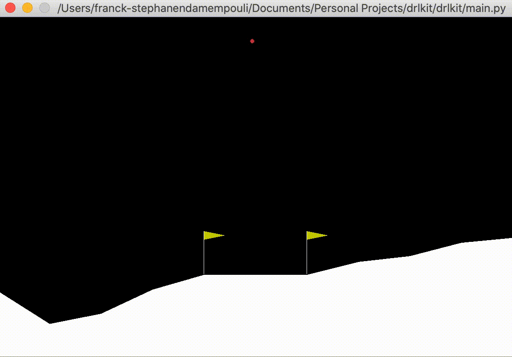

<p align="center">
 
</p>

--------------------------------------------------------------------------------
<br/>
<p align="center">
   <a>
      
   </a>
   <a>
      
   </a>
   <a>
      
   </a>
   <a href="https://opensource.org/licenses/MIT">
      
   </a>
   <a href="https://opensource.org/licenses/MIT">
      
   </a>
  </p>

<br/>
<p align="center">
 A High Level Python Deep Reinforcement Learning library.<br> 
 Great for beginners,  prototyping and quickly comparing algorithms
</p>

<br/>
<p align="center">
 
</p>


## Installation

Install drlkit via pip

```python
pip install drlkit
```

## Usage 📖
**1.** Import the modules
```python
import numpy as np
from agents.TorchAgent import TorchAgent
from utils.plot import Plot
from environments.wrapper import EnvironmentWrapper
```
**2.** Initialize the environment and the agent
```python
ENV_NAME = "LunarLander-v2"
env = EnvironmentWrapper(ENV_NAME)
agent = TorchAgent(state_size=8, action_size=env.env.action_space.n, seed=0)
```
**3.** Train the agent
```python
# Train the agent
env.fit(agent, n_episodes=1000)
```
**4.** Plot the results (optional)
```python
# See the results
Plot.basic_plot(np.arange(len(env.scores)), env.scores, xlabel='Episode #', ylabel='Score')
```
**5.** Play 🎮
```python
# Play trained agent
env.play(num_episodes=10, trained=True)
```
It is as simple as that! 🤯

### Loading a model 🗃
```python
ENV_NAME = "LunarLander-v2"
env = EnvironmentWrapper(ENV_NAME)
agent = TorchAgent(state_size=8, action_size=env.env.action_space.n, seed=0)

env.load_model(agent, "./models/LunarLander-v2-4477.pth")
env.play(num_episodes=10)
```

### Play untrained agent
```python
env.play(num_episodes=10, trained=False)
```
<br>
<p align="center">
 
</p>


### Play trained agent (4477 episodes, 3 hours)
```python
env.play(num_episodes=10, trained=True)
```
<br>
<p align="center">
 
</p>

## Tested Environments ⛳️

| **Environment**             |
| --------------------------- |
| LunarLander-v2              |
| CartPole-v1                 |
| MountainCar-v0              |


## Implemented Algorithms 📈
`Done` = :heavy_check_mark: ||
`In Progress` = :heavy_minus_sign: ||
`Not done yet` = :x: 

| **Algorithms**              | **Status**                        | **Tested**                        |
| --------------------------- | --------------------------------- | --------------------------------- |
| DQN                         | :heavy_check_mark: <sup>(1)</sup> | :heavy_check_mark:                |
| DDPG                        | :heavy_minus_sign:                | :heavy_minus_sign:                |
| PPO1                        | :x:                               | :x:                               |
| PPO2                        | :x:                               | :x:                               |
| A2C                         | :x:                               | :x:                               |
| SAC                         | :x:                               | :x:                               |
| TD3                         | :x:                               | :x:                               |

## 👀 Next steps

* [x] Implement DQN
* [x] Test DQN
* [-] Finish DDPG
* [ ] Implement PP01
* [ ] Improve documentation


## ❤️ Contributing
This is an open source project, so feel free to contribute. How?
- Open an [issue](https://github.com/FranckNdame/drlkit/issues/new).
- Send feedback via [email](mailto://franck.mpouli@gmail.com).
- Propose your own fixes, suggestions and open a pull request with the changes.


## 🤖‍ Author

* Franck Ndame

## 👮🏻 License

```
MIT License

Copyright (c) 2017 Juanpe Catalán

Permission is hereby granted, free of charge, to any person obtaining a copy
of this software and associated documentation files (the "Software"), to deal
in the Software without restriction, including without limitation the rights
to use, copy, modify, merge, publish, distribute, sublicense, and/or sell
copies of the Software, and to permit persons to whom the Software is
furnished to do so, subject to the following conditions:

The above copyright notice and this permission notice shall be included in all
copies or substantial portions of the Software.

THE SOFTWARE IS PROVIDED "AS IS", WITHOUT WARRANTY OF ANY KIND, EXPRESS OR
IMPLIED, INCLUDING BUT NOT LIMITED TO THE WARRANTIES OF MERCHANTABILITY,
FITNESS FOR A PARTICULAR PURPOSE AND NONINFRINGEMENT. IN NO EVENT SHALL THE
AUTHORS OR COPYRIGHT HOLDERS BE LIABLE FOR ANY CLAIM, DAMAGES OR OTHER
LIABILITY, WHETHER IN AN ACTION OF CONTRACT, TORT OR OTHERWISE, ARISING FROM,
OUT OF OR IN CONNECTION WITH THE SOFTWARE OR THE USE OR OTHER DEALINGS IN THE
SOFTWARE.
```

